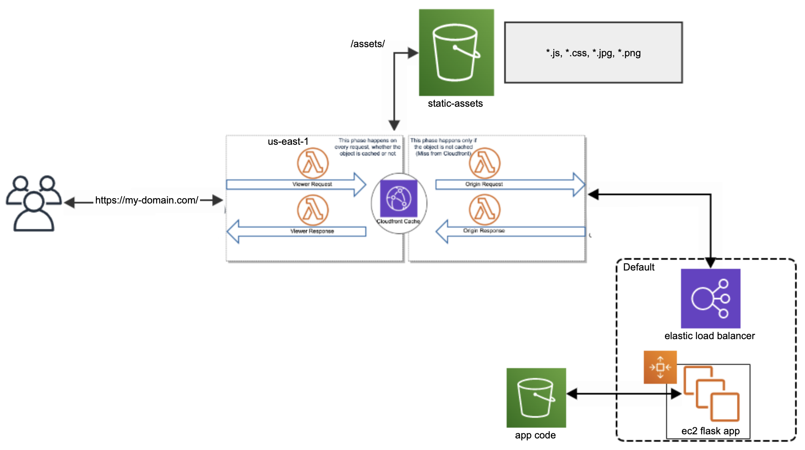

# Mutirao Devops - Cloudfront Demo

## General Arch

The general arch for cloudfront distributions



## How to run it

replace those values with your current environment:

| Variable               | Description 
|------------------------|------------------------------------------------------------------------------------------------------|
| TF_VAR_ssh_key         | ssh key for your ec2 instance                                                                        |
| TF_VAR_certificate_arn | certificate acm - it needs to be created atr us-east-1                                               |              
| TF_VAR_vpc_id          | Id of the vpc to place scaling                                                                       |
| TF_VAR_aliases         | alias/domains set on your cloudfront - but it needed to be covered by the certificate created at ACM |


Set those vars then run:
```bash
# export TF_VARS_* here
terraform init
terraform plan
terraform apply
```
It will generate:

| Resource                | Qty  |Region              |
--------------------------|------|--------------------|
| s3 bucket - assets      |  1   | Default            |
| s3 bucket - code        |  1   | Default            |
| s3 bucket - policies    |  2   | Default            |
| Cloudfront              |  1   | Global             |
| Security group          |  2   | Default            |
| Launch configuration    |  1   | Default            |
| Auto scaling group      |  1   | Default            |
| Elb                     |  1   | Default            |
| Elb Cookies stickness   |  1   | Default            |
| Lambda@edge             |  4   | us-east-1          |
| Lambda@edge Permissions |  4   | us-east-1          |
| Lambda@edge Policies    |  4   | us-east-1          |


## How to run tests
```bash
cd cloudfront/src/lambdas/tests

pip3 install -U pytest

pytest
```

## How to destroy it
```bash
# export TF_VARS_* here
terraform destroy
```
